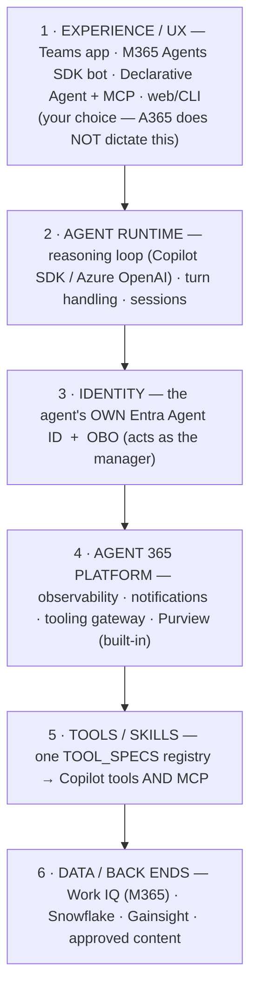
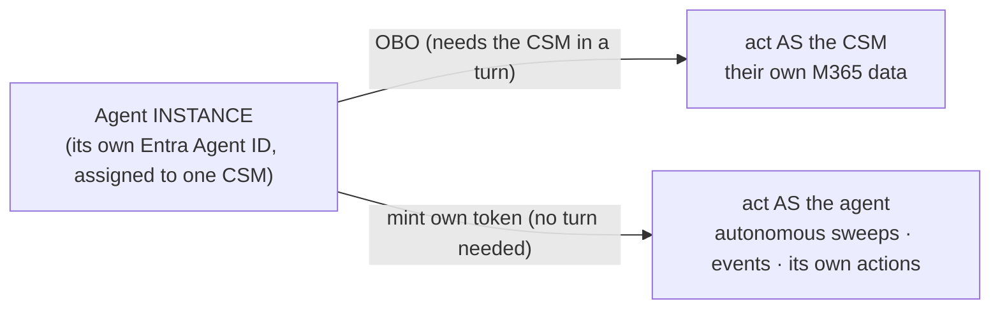
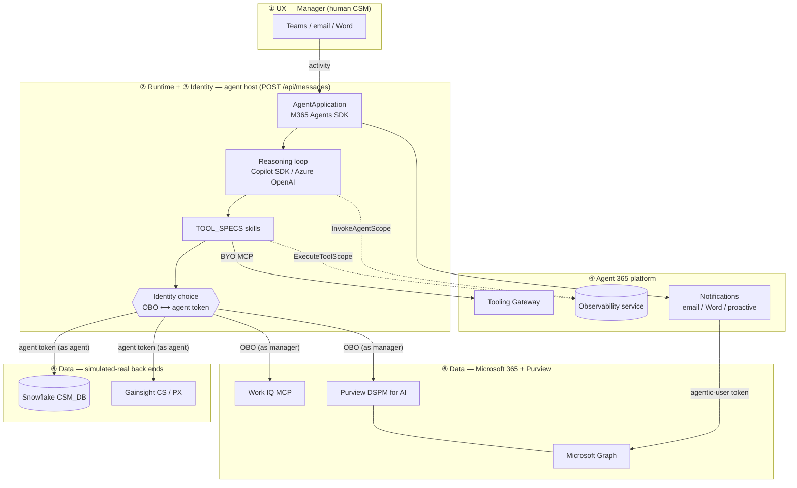
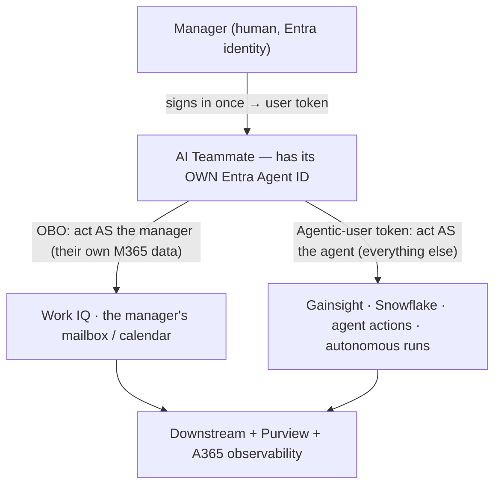
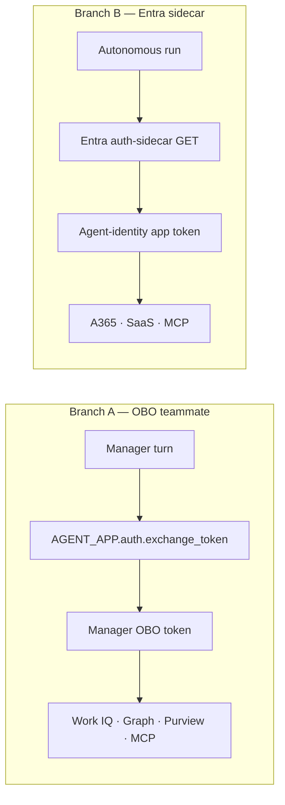

# Agent 365 + Purview SDK Deep Dive — Developer Deck

> **For Copilot Cowork — how to build this deck:**
> 1. **One slide per `## Slide N — …` heading.** Keep the order; do not merge or resequence.
> 2. **Body** = the bullet list / table under the heading. Tighten wording to fit; never drop a
>    code block or a diagram.
> 3. **Code** = render each fenced code block in a monospace box, shrink-to-fit, no wrapping;
>    keep comments (they're the teaching points).
> 4. **Diagrams** = render every ```mermaid``` block as an image on its slide.
> 5. **Speaker notes** = put the `> Speaker notes:` block verbatim into the slide's notes pane,
>    not on the slide face.
> 6. **Section dividers** (`## Slide N — SECTION: …`) are full-bleed title slides.
> 7. **Theme** = dark technical, accent teal. Title + dividers full-bleed.
>
> **Reading path:** Architecture (4–8) → Environment/CLI (9–14) → Scaffolding step-by-step
> (15–18) → **Identity, the two tokens** (19–23b) → Observability (24–30) → Notifications
> (31–33) → Tooling Gateway (34–37) → Purview (38–43) → **Branch B: Entra sidecar** (44–50) →
> Guardrails/close (51–53).

---


## Slide 1 — Title

# Building an Agent 365 AI Teammate
### Identity · Observability · Notifications · Tooling Gateway · Purview — done correctly

**A code-level deep dive into the Digital CSM AI Teammate**
Plus a branch on the **Entra sidecar** token pattern (`ess-mcp / demo_agent`)

> Speaker notes: This is a developer session. We walk the real code of a shipping Agent 365
> teammate — not slideware. Two identity models are covered: On-Behalf-Of (the CSM teammate)
> and the autonomous Entra-sidecar pattern. By the end you can stand up the environment with
> the `a365` CLI, wire identity/observability/notifications, register an MCP server on the
> Tooling Gateway, and integrate Purview DSPM the right way.

---

## Slide 2 — What you'll leave with

- **The layered model** — UX (layer 1) down to tools & data (layer 6), and where A365 sits.
- **Why an *instance*** — not "install one app for everyone + pure OBO": the instance can act *as
  the manager* **and** *as itself*.
- **What A365 adds** — identity, observability, notifications, tool governance & Purview that are
  "built in" for Copilot/Foundry/Studio, made true for **your** coded/hosted agent.
- **Set up the environment** with the `a365` CLI (blueprint, permissions, infra) — never by hand.
- **Read the scaffolding**: Microsoft 365 Agents SDK app, import-time singletons, handlers.
- **Identity**: act *as the manager* via **OBO**, and *as the agent* via its **own** Entra Agent ID.
- **Observability**: the A365 Observability SDK + OTEL, and the two silent-failure traps.
- **Notifications**: proactive 1:1 Teams (agentic-user token) + inbound email/Word handlers.
- **A365 Tooling Gateway**: registering a BYO MCP server and consuming it *governed*.
- **Purview DSPM for AI**: `processContent` / `protectionScopes` done correctly.
- **Branch**: the **Entra sidecar** pattern for autonomous agent-identity tokens.

> Speaker notes: Agenda mapping: the "why" front section (2a–2f), then 4–8 architecture, 9–14
> environment/CLI, 15–18 scaffolding, 19–23b identity (the two tokens), 24–30 observability,
> 31–33 notifications, 34–37 gateway, 38–43 Purview, 44–50 the sidecar branch, 51+ guardrails.
> The first three bullets are the new framing the audience asked for: the layer model, the
> instance decision, and the A365 value-add.

---

## Slide 2a — SECTION: Why a hosted agent — and why an *instance*

# From UX down to data: the layered model
### Identity · observability · notifications — "built in" for Copilot/Foundry/Studio, now for **your** code

> Speaker notes: This section answers the two questions developers actually ask before any code:
> (1) why build/host my own agent when Copilot, Foundry and Copilot Studio already exist, and
> (2) why give each user their **own agent instance** instead of installing one shared app behind
> pure OBO. The answers thread through every later section, so we set them up first.

---

## Slide 2b — The six layers (UX is layer 1; data is the floor)



- **Layer 1 (UX) is yours.** A365 governs layers 3–4 the **same** regardless of the front door.
- **Layers 3–4 are where this deck lives** — the "built-in" platform value, made real for coded agents.
- Everything below (5–6) is authorized by the identity chosen at **layer 3**.

> Speaker notes: This is the spine of the whole deck and the order we present in. Read top-down: a
> human touches layer 1; the runtime (2) turns intent into tool calls; every call is authorized by
> an identity (3); A365 (4) governs and observes it; tools (5) execute against data (6). The point:
> identity/observability/notifications sit in the middle and are independent of the UX you pick.

---

## Slide 2c — A365 is UX-agnostic: the front door is a free choice

| Front door (layer 1) | Example | A365 identity / obs / notifications |
|---|---|---|
| **Teams app** (this repo) | tabs + 1:1 chat | ✅ same |
| **M365 Agents SDK bot** | `POST /api/messages` | ✅ same |
| **Declarative Agent + MCP plugin** | Copilot extensibility | ✅ same |
| **Your own web / CLI** | custom UI | ✅ same |

- A365 says **nothing** about how a user interacts — it governs the **agent**, not the UI.
- Pick the UX that fits; the identity, telemetry and notification wiring is **unchanged**.

> Speaker notes: A de-risking point. We chose Teams here for the tabs + the HITL review queue. But
> the same agent identity, the same observability export, the same Purview governance apply if you
> front the agent with a Declarative Agent + MCP plugin, or a plain web app. A365 is deliberately
> UX-agnostic — that's a feature, not a gap, and it means layer 1 never locks you in.

---

## Slide 2d — Three ways to ship the same agent

| | (A) Shared app + pure OBO | (B) One shared agent identity | (C) **Per-manager instance** (this build) |
|---|---|---|---|
| Who it is | a generic app | one agent for everyone | **one agent per CSM**, under one blueprint |
| Acts as | only the signed-in user | the shared agent | the manager (OBO) **and** itself |
| Autonomous (no human)? | ❌ needs a live user turn | ⚠️ one principal for all | ✅ mints its own token |
| Per-user governance | ❌ users collapse to one app | ❌ one principal | ✅ access packages / CA / risk **per instance** |
| Audit attribution | the user only | one blob | **this agent, for this CSM** |
| Blast radius | broad | broad | **scoped to one CSM's book** |

- (A) and (B) **cannot act autonomously as a governed agent**; (C) can.
- (C) is the Agent 365 model: **one blueprint + one instance per human it works for**.

> Speaker notes: This is the crux the audience asked for. Option A — install one app, everyone
> shares it, pure OBO — is the naive default: it only ever acts as whoever is signed in, so it can
> do nothing autonomously, and every user collapses to one app principal for governance and audit.
> Option B gives the agent an identity, but one shared one — still no per-user isolation. Option C,
> a per-manager instance under a single blueprint, is what makes per-user governance, autonomous
> action, and clean audit attribution possible **at the same time**.

---

## Slide 2e — Why the instance: it can do OBO *and* mint its own token



- **Only an instance has both halves:** a manager to OBO *for*, and its own identity to mint *as*.
- A shared app has no own-identity to mint; pure OBO has no token without a live user.
- **The advantage:** it can work the book **proactively** (a sweep, a signal landing, a timer) as a
  **governed, named** identity — not a generic app, and not "nothing."

> Speaker notes: This connects the instance decision to the identity mechanics we deep-dive later
> (19–23b). The instance is the only shape that holds both halves: it's bound to a manager (so OBO
> is meaningful) and it's its own first-class Entra principal (so it can mint its own token and act
> when no human is present). That dual capability is the entire reason to prefer an instance — and
> it's why "Siva runs a sweep for every account" works without Siva clicking through each one.

---

## Slide 2f — What Agent 365 adds (the "built-in" you get for free)

| Pillar | Copilot / Foundry / Studio | A coded / hosted agent (naive) | A365 makes them equal |
|---|---|---|---|
| **Entra Agent ID** | built-in | hand-rolled app regs | blueprint + instances via `a365` CLI |
| **Observability** | built-in to admin center | build your own OTLP plumbing | `microsoft-agents-a365` SDK → admin center |
| **Notifications** | built-in | poll Graph yourself | inbound email/Word + proactive handlers |
| **Tool governance** | built-in | ungoverned MCP | BYO MCP on the Tooling Gateway |
| **Purview DSPM** | built-in | invisible to compliance | `processContent` attributed to the agent |

- These are **free** for Copilot/Foundry/Studio because they live on the platform.
- **This deck makes them true for *your* code** — same governance, your own runtime + UX.

> Speaker notes: The value proposition in one slide. The pitch of A365 for a builder: the governance
> pillars that come for free inside Copilot, Foundry and Copilot Studio — identity, observability,
> notifications, tool governance, Purview — you can now get for a hand-coded or hosted agent, without
> surrendering your runtime or your UX. The rest of the deck is *how*, layer by layer.

---

## Slide 3 — Two identity patterns, one platform

> **The mental model:** an Agent 365 teammate can act **as a human** (delegated/OBO) *or* **as
> itself** (its own Entra Agent ID). This deck's CSM teammate does **both**, choosing per action.
> A separate repo (`ess-mcp/demo_agent`) shows the *sidecar* variant of "act as itself."

| | **Branch A — OBO teammate** (this repo) | **Branch B — Entra sidecar** (`ess-mcp/demo_agent`) |
|---|---|---|
| Acts as | The **manager** (delegated) **and** itself | **Itself** (autonomous agent identity) |
| Token source | `auth.exchange_token(...)` **and** `get_agentic_user_token(...)` | Local **Entra auth-sidecar** HTTP call |
| Best for | Human-in-the-loop **plus** autonomous CSM work | Background / app-only automation |
| Downstream auth | OBO token **or** agentic-user token | Agent client-assertion / token-exchange |
| Risk attribution | The **user** (OBO) **or** the **agent** (own token) | The **agent identity** |

- All three register on the **A365 Tooling Gateway**, emit **A365 observability**, use **Purview**.
- The only question per call is *whose token authorizes it* — and that's an explicit choice.

> Speaker notes: This slide frames the whole deck. Most teams think "OBO agent" = "always acts as
> the human" — that's incomplete. A first-class Agent 365 teammate has its OWN identity and uses it
> for its own actions; OBO is reserved for touching the human's own data. We deep-dive that
> per-action choice in Identity (19–23b), then show the sidecar variant (B).

---

## Slide 4 — What the CSM AI Teammate is

- A **Digital Customer Success Manager** teammate with its **own Entra Agent ID**…
- …that acts **as its manager** (OBO) for the manager's own data, and **as itself** for everything else.
- Built on the **Microsoft 365 Agents SDK** (Python, aiohttp, `POST /api/messages`).
- Reasons via the **GitHub Copilot SDK** (or an Azure OpenAI managed-identity fallback).
- Grounds in Microsoft 365 through the **Work IQ MCP** server (delegated/OBO, *not* Copilot Chat API).
- Exposes its skills over **MCP**, registered on the **A365 Tooling Gateway**.
- Emits **OpenTelemetry** to the **A365 observability** service; governs prompts/responses with **Purview DSPM**.

> Speaker notes: The "five CSM agents" from the design docs are realised as Pydantic `@define_tool`
> skills + matching MCP tools, all from one `TOOL_SPECS` registry. Back ends (Snowflake, Gainsight)
> are simulated-real; Microsoft 365 / Work IQ and Purview are the real integrations.

---

## Slide 5 — Architecture (system view, mapped to the six layers)



> Speaker notes: This is slide 2b's layer model made concrete. ① the human touches the UX; ② the
> runtime turns intent into tool calls; ③ each call picks an identity — OBO for the manager's own
> M365 data (Work IQ, Purview on the manager), the agent's own token for Gainsight/Snowflake/its
> own actions; ④ A365 observes (every turn + tool scope) and governs (gateway, Purview, proactive
> notifications); ⑥ tools hit data. Note the two identity edges out of the diamond — that's the
> per-action choice we deep-dive in the Identity section.


---

## Slide 6 — Identity model (the core principle)



- The agent's **own identity** authenticates the agent, registers on the Gateway, signs telemetry,
  **and authorizes everything the agent does that isn't the manager's own data**.
- **OBO** is used **only** to act *as the manager* — reading/writing the manager's own Microsoft 365.
- **Rule of thumb:** *"as the manager"* → OBO; *"as the agent"* → the agent's own token. Never a
  bare, ungoverned app identity.

> Speaker notes: This is the one diagram to remember — a refinement of the naive "OBO everywhere"
> model. Two arrows out of the agent: OBO when it needs the manager's own data (their mailbox), the
> agent's own token for everything else. The punchline lands on slide 23a: the agent's own token
> needs NO live turn, so it works for autonomous events.

---

## Slide 7 — Repository map (where everything lives)

```text
src/
  main.py            # entry: OTEL first → A365 obs → build app → serve
  agent.py           # AgentApplication singletons + handlers + per-turn context
  start_server.py    # aiohttp host: POST /api/messages
  telemetry.py       # configure_otel_providers() — OTLP/gRPC
  observability.py   # A365 Observability SDK: configure + scopes + token
  identity.py        # RequestContext + OBO exchange + user resolution
  notifications.py   # proactive 1:1 Teams + inbound A365 handlers
  purview.py         # Purview DSPM: processContent / protectionScopes
  workiq_client.py   # real Work IQ MCP client (manager OBO)
  reasoning.py / copilot_session.py  # the LLM tool-calling loop
  tools/ + skills/   # TOOL_SPECS — single source of truth for tools
  mcp/
    server.py        # FastMCP server (all tools)
    gateway.py       # BYO registration on the Tooling Gateway
A365_SDK_AND_CLI_GUIDE.md   # authoritative a365 CLI + Observability SDK guide
```

> Speaker notes: The repo deliberately mirrors the Microsoft samples. One golden rule: tools come
> from a single `TOOL_SPECS` registry so the Copilot surface and the MCP surface never drift.

---

## Slide 8 — Stack & exact dependencies

```text
# Microsoft 365 Agents SDK (hosting + auth + activity)
microsoft-agents-activity
microsoft-agents-hosting-core
microsoft-agents-hosting-aiohttp
microsoft-agents-authentication-msal

github-copilot-sdk        # imported as `copilot`
mcp                       # MCP client + FastMCP server
microsoft-agents-a365     # A365 Observability SDK
openai + azure-identity   # NL-to-SQL + drafts via MANAGED IDENTITY (never keys)
opentelemetry-* (sdk, exporter-otlp, instrumentation-*)
```

- **Import names use underscores:** `microsoft_agents.*` (not `microsoft.agents`).
- `github-copilot-sdk` → `from copilot import CopilotClient, define_tool, …`.
- Azure OpenAI is **managed-identity only** — `DefaultAzureCredential` + `get_bearer_token_provider`.

> Speaker notes: The hyphen-on-PyPI / underscore-on-import gap trips everyone up once. And the
> no-keys rule is a hard tenant policy here: shared-key access is disabled, so everything Azure is
> managed identity + RBAC.

---

## Slide 9 — SECTION: Setting up the environment

# Provision with the `a365` CLI
### Never click through the Entra/Azure portals for this

> Speaker notes: Section divider. The single most important operational rule: the blueprint app,
> the agent instance, the MCP + bot OAuth2 permissions, and the supporting Azure infra are ALL
> created by the `a365` CLI. Hand-rolling app registrations is how you get subtly-wrong consent.

---

## Slide 10 — Install the CLI

```powershell
dotnet tool install -g Microsoft.Agents.A365.DevTools.Cli
dotnet tool update  -g Microsoft.Agents.A365.DevTools.Cli
a365 --version
```

- It's a cross-platform **.NET global tool** (`Microsoft.Agents.A365.DevTools.Cli`).
- It checks for updates on every run — if the CLI behaves oddly, **update before debugging**.

> Speaker notes: The CLI automates the Entra ID, Azure, and M365 admin-center provisioning you'd
> otherwise do by hand. Preview tool — version drift is the #1 cause of weird behaviour.

---

## Slide 11 — The CLI command map

```text
a365
├── setup            ← provision Entra + Azure + permissions
│   ├── requirements   check prerequisites only
│   ├── blueprint      create the Entra blueprint app
│   ├── permissions
│   │   ├── mcp        OAuth2 grants for MCP tools
│   │   └── bot        OAuth2 grants for bot endpoints
│   └── all            do everything (needs Global Admin)
├── develop / develop-mcp   ← run/register MCP servers
├── query-entra      ← read-only inspection (blueprint-scopes / instance-scopes)
├── cleanup          ← undo (blueprint / instance / azure)
└── publish          ← package + manifest for the M365 admin center
```

> Speaker notes: Four verbs you actually use: setup, query-entra, develop-mcp, cleanup. Everything
> else hangs off those. Note cleanup mirrors setup, so a botched run is reversible.

---

## Slide 12 — Flow A: first-time setup

```powershell
a365 setup requirements        # optional sanity check
a365 setup blueprint           # creates the Entra app + service principal
a365 setup permissions mcp     # grants MCP-related OAuth2 scopes
a365 setup permissions bot     # grants bot-related OAuth2 scopes
```

Or, with **Global Administrator**, do it all at once:

```powershell
a365 setup all --agent-name CsmTeammate
```

- If you're **not** a Global Admin, `setup all` prints exactly what an admin must consent.
- This is what creates the **blueprint** and the **MCP/bot permissions** the Gateway needs.

> Speaker notes: The blueprint is the agent-type identity. `permissions mcp` and `permissions bot`
> are the OAuth2 grants that make Tooling Gateway tools and the bot endpoint work. Don't grant
> these by hand in the portal — the CLI does the consent dance correctly.

---

## Slide 13 — Inspect, then clean up

```powershell
a365 query-entra blueprint-scopes     # scopes + consent on the blueprint
a365 query-entra instance-scopes      # ...and on an agent instance

a365 cleanup --agent-name CsmTeammate -y
```

**Roles each step needs**

| Step | Minimum role |
|---|---|
| `setup blueprint` | Agent ID Developer |
| `setup permissions …` | Global Administrator |
| `setup all` (infra) | + Azure Subscription Contributor |
| `cleanup` | Same as the matching setup step |

> Speaker notes: `query-entra` is your read-only truth source for "is consent actually granted?".
> A failed registration does NOT roll back the Entra apps it created — so `cleanup` and re-run is
> the standard recovery loop.

---

## Slide 14 — Configuration: the SDK env hierarchy

`load_configuration_from_env` consumes the `CONNECTIONS__*` / `AGENTAPPLICATION__*` double-underscore tree:

```dotenv
# Agent's OWN identity (created by the a365 CLI; copy ids here — don't hand-make apps)
CONNECTIONS__SERVICE_CONNECTION__SETTINGS__CLIENTID=
CONNECTIONS__SERVICE_CONNECTION__SETTINGS__CLIENTSECRET=
CONNECTIONS__SERVICE_CONNECTION__SETTINGS__TENANTID=

# OBO exchange connection (acts on behalf of the manager)
CONNECTIONS__OBO__SETTINGS__CLIENTID=
AGENTAPPLICATION__USERAUTHORIZATION__AUTOSIGNIN=true
AGENTAPPLICATION__USERAUTHORIZATION__HANDLERS__OBO__SETTINGS__OBOCONNECTIONNAME=OBO

# Agentic user-authorization handler (proactive Teams + observability token)
AGENTAPPLICATION__USERAUTHORIZATION__HANDLERS__AGENTIC__SETTINGS__TYPE=AgenticUserAuthorization

AGENT__IDENTITY__AGENT_ID=          # the agent's own Entra Agent ID
AGENT__IDENTITY__BLUEPRINT_ID=      # the Entra blueprint app id
```

> Speaker notes: Note three handlers: OBO (act as manager), GITHUB (per-user Copilot identity), and
> AGENTIC (the agent's own agentic-user token — used for observability export and proactive Teams).
> The `CONNECTIONS__`/`AGENTAPPLICATION__` keys are SDK-parsed; the `AGENT__`/`A365__` keys are ours.

---

## Slide 15 — SECTION: Step through the code

# Scaffolding: from `python -m src.main` to a live turn

> Speaker notes: Section divider. We now read the actual files in execution order: main → agent
> singletons → handlers → reasoning loop. The ordering in main.py is load-bearing.

---

## Slide 16 — Entry point: order matters (`main.py`)

```python
# 1) OTEL FIRST — before importing the agent/server, so global providers
#    are installed before any instrumented library loads.
from .telemetry import configure_otel_providers
configure_otel_providers(service_name="csm_ai_teammate")

from .observability import configure_a365_observability
configure_a365_observability()

# 2) SDK logging, then 3) build app + serve
from .agent import AGENT_APP, CONNECTION_MANAGER
from .start_server import start_server

start_server(
    agent_application=AGENT_APP,
    auth_configuration=CONNECTION_MANAGER.get_default_connection_configuration(),
)
```

> Speaker notes: If you import the agent before configuring OTEL, the aiohttp/requests
> instrumentation attaches to the wrong (default) provider and you silently lose auto-traces. This
> "telemetry first" ordering is the single most common observability bug.

---

## Slide 17 — Import-time singletons (`agent.py`)

```python
agents_sdk_config = load_configuration_from_env(environ)

STORAGE = MemoryStorage()
CONNECTION_MANAGER = MsalConnectionManager(**agents_sdk_config)
ADAPTER = CloudAdapter(connection_manager=CONNECTION_MANAGER)
AUTHORIZATION = Authorization(STORAGE, CONNECTION_MANAGER, **agents_sdk_config)

AGENT_APP = AgentApplication[TurnState](
    storage=STORAGE, adapter=ADAPTER, authorization=AUTHORIZATION, **agents_sdk_config,
)

# Register A365 inbound notification handlers (email / Word / lifecycle)
NOTIFIER = notifications.register_inbound_handlers(AGENT_APP)
```

- Constructed **once at module import** — never per request.
- `AGENT_APP.auth` (the `Authorization`) is what performs OBO later.

> Speaker notes: These are module-level globals on purpose. The SDK keeps conversation state in
> STORAGE; the adapter + connection manager hold the MSAL auth wiring. Recreating them per turn
> breaks auth and state.

---

## Slide 18 — Handlers + per-turn request context

```python
@AGENT_APP.activity("message")
async def on_message(context: TurnContext, _state: TurnState):
    ctx = _request_context(context)          # resolve the REAL inbound manager
    token = identity.set_request_context(ctx)  # contextvar — tools read it later
    try:
        await observability.setup_observability_token(AGENT_APP.auth, context)
        github_token = await identity.get_user_token(config.GITHUB_AUTH_HANDLER_ID)
        workiq_obo   = await identity.exchange_obo_token([config.WORKIQ_SCOPE])

        with observability.invoke_agent_scope(content=user_text,
                                              session_id=ctx.conversation_id,
                                              conversation_id=ctx.conversation_id):
            session = await copilot_session.get_session(ctx.session_key, github_token, workiq_obo)
            await copilot_session.stream_turn(session, user_text, context)
    finally:
        identity.reset_request_context(token)
```

> Speaker notes: One turn does four identity things up front — set the per-turn context, cache the
> observability token, get the per-user GitHub token, and pre-exchange the Work IQ OBO token — then
> runs the whole turn inside an `invoke_agent_scope`. State is keyed by `manager_id:conversation_id`
> so one manager's context never leaks to another.

---

## Slide 19 — SECTION: Identity & OBO

# Acting *as the manager*, *with* the agent's identity

> Speaker notes: Section divider. This is Branch A's defining behaviour and the most important
> security property of the whole system.

---

## Slide 20 — Per-turn context (`identity.py`)

```python
@dataclass
class RequestContext:
    manager_id: str
    conversation_id: str
    turn_context: object | None = None   # the SDK TurnContext
    entra_object_id: str | None = None   # the signed-in manager's oid

    @property
    def session_key(self) -> str:
        return f"{self.manager_id}:{self.conversation_id}"

_current: contextvars.ContextVar[RequestContext | None] = contextvars.ContextVar(
    "csm_request_context", default=None)
```

- A **contextvar** carries the manager through async tool calls — no threading the context everywhere.
- The inbound manager is resolved from `activity.from_property.aad_object_id` (no extra API call).

> Speaker notes: The contextvar is what lets a deeply-nested tool ask "who is my manager and what's
> their token?" without passing context down every call. The session key isolates state per
> manager+conversation.

---

## Slide 21 — The OBO token exchange (verified shape)

```python
async def exchange_obo_token(scopes: list[str]) -> str | None:
    ctx = _current.get()
    if ctx is None or ctx.turn_context is None:
        return None                      # no live turn → no OBO (e.g. background)
    from .agent import AGENT_APP
    token_response = await AGENT_APP.auth.exchange_token(
        ctx.turn_context, scopes, config.OBO_HANDLER_ID   # 3 positional args
    )
    return getattr(token_response, "token", None)          # BARE token
```

- Verified call shape: `exchange_token(context, scopes: list[str], auth_handler_id: str)`.
- Returns the **bare** token string. Sign-out: `auth.sign_out(context, "<HANDLER_ID>")`.

> Speaker notes: This is THE method. Three positional args, returns a TokenResponse, take `.token`.
> The handler id ("OBO") maps to the `CONNECTIONS__OBO__*` / `HANDLERS__OBO__*` env wiring. If
> there's no live turn (autonomous run) you get None — which is exactly when Branch B's sidecar
> would step in.

---

## Slide 22 — Pick the identity per action (`identity.py`)

```python
async def acquire_delegated_token(resource, scopes, *, as_manager=False) -> tuple[str|None, bool]:
    if as_manager:                                  # the manager's OWN data → OBO
        real = await exchange_obo_token(scopes)
        if real:
            return real, True
    else:                                           # everything else → the AGENT's own token
        agent_token, ok = await acquire_agent_token(scopes)
        if ok and agent_token:
            return agent_token, True
        real = await exchange_obo_token(scopes)     # bot path may still carry a manager token
        if real:
            return real, True
    who = current_context().upn or current_manager_id()
    return f"sim-deleg:{resource}:{who}", False     # offline: clearly-marked simulation
```

- **One call decides the actor.** `as_manager=True` → **OBO**; default → the **agent's own** token.
- `(token, is_real)` lets simulators enforce per-identity RBAC exactly like the real API.

> Speaker notes: This is the heart of the refined model. A single helper makes the per-action
> choice explicit: touching the manager's own data takes OBO; everything else takes the agent's own
> governed identity, with a graceful fall-back to a manager token (bot path) then a clearly-marked
> simulated token offline. No bare app identity ever authorizes a real action.

---

## Slide 23 — Grounding via Work IQ MCP (manager OBO)

```python
async def call_tool(tool_name, arguments, obo_token) -> str:
    headers = {"Authorization": f"Bearer {obo_token}"}      # manager OBO — delegated only
    async with streamablehttp_client(config.WORKIQ_MCP_ENDPOINT, headers=headers) as (r, w, _):
        async with ClientSession(r, w) as session:
            await session.initialize()
            result = await session.call_tool(tool_name, arguments)
    return _extract_text(result)
```

- Work IQ is **Entra delegated-only** — app-only is **not** supported. Always the **manager OBO** token.
- Scope: `api://workiq.svc.cloud.microsoft/WorkIQAgent.Ask`. Endpoint stays in config (Public Preview).

> Speaker notes: Work IQ MCP is how the agent reasons over M365 (mail, calendar, files, people,
> Copilot `ask`). It is a remote MCP server — we're an MCP *client* here. Because it's delegated-only,
> the server-side control plane (no user turn) instead reads the mailbox/calendar via Graph using the
> host managed identity. Never send Work IQ a bare app token.

---

## Slide 23a — The agent's OWN token (no turn required) (`agentic_identity.py`)

```python
async def acquire_agent_token(scopes, *, manager_id=None) -> tuple[str|None, bool]:
    if not config.ENABLE_AGENTIC_IDENTITY:
        return None, False
    instance_app_id, agent_user_oid = resolve_instance(manager_id)   # ids, not a user turn
    if not (config.AGENT_TENANT_ID and instance_app_id and agent_user_oid):
        return None, False
    conn = _get_connection()                                          # blueprint confidential client
    token = await conn.get_agentic_user_token(                        # ← mints the agent's own token
        config.AGENT_TENANT_ID, instance_app_id, agent_user_oid, scopes)
    return (token, True) if token else (None, False)
```

- Inputs are **identifiers** (tenant + instance app id + agent-user oid) + the blueprint's creds.
- **No `TurnContext`, no user assertion** → a **system hook** (sweep, timer, signal) can mint it.
- Gated by `AGENT__AGENTIC_IDENTITY__ENABLE`; falls back to MI / simulation if not enabled.

> Speaker notes: This is the slide that answers "can it act with no human present?" Yes. Unlike OBO,
> this takes only ids — so an autonomous run (a fleet sweep, an event hook) acts as the agent's own
> governed Entra Agent ID. That's what makes Agent ID sign-in logs, Conditional Access for agents,
> ID Protection, access packages, and DSPM-attribution-to-the-agent actually bite on autonomous work.

---

## Slide 23b — Why it needs no turn: OBO vs agentic-user (the SDK proof)

```python
# OBO (MsalAuth.acquire_token_on_behalf_of) — REQUIRES a signed-in user's assertion:
msal_client.acquire_token_on_behalf_of(scopes=scopes, user_assertion=<USER_TOKEN>)
#   └─ raises on ManagedIdentity; there is no user token without a live turn.

# Agentic-user (MsalAuth.get_agentic_user_token) — pure CLIENT CREDENTIALS, no user token:
#   1) get_agentic_application_token: acquire_token_for_client(data={"fmi_path": instance_id})
#   2) get_agentic_instance_token:    acquire_token_for_client(client_assertion = app_token)
#   3) get_agentic_user_token:        acquire_token_for_client(data={
#          "user_id": agent_user_oid,
#          "user_federated_identity_credential": instance_token,
#          "grant_type": "user_fic"})
```

- OBO = **`acquire_token_on_behalf_of`** → needs `user_assertion` → needs a live turn.
- Agentic-user = a chain of **`acquire_token_for_client`** (`fmi_path` → `user_fic`) → **no turn**.

> Speaker notes: This is the verbatim proof from the installed SDK (`msal_auth.py`). The whole
> agentic-user chain is client-credentials — `acquire_token_for_client` with `fmi_path`, then a
> federated `user_fic` grant — and never calls `acquire_token_on_behalf_of`. That's the technical
> reason a no-human system event can still run as the agent's own identity. Branch B (sidecar)
> performs the same MSI→agent-identity exchange, just outside the process.


---

## Slide 24 — SECTION: Observability

# OTEL providers + the A365 Observability SDK

> Speaker notes: Section divider. Two layers: standard OTEL providers (telemetry.py) and the A365
> SDK that wraps them into authenticated exports (observability.py). Plus the two env toggles that
> make the difference between "looks like it works" and "actually exports."

---

## Slide 25 — OTEL providers (`telemetry.py`)

```python
def configure_otel_providers(service_name=None):
    resource = Resource.create({
        "service.name": config.SERVICE_NAME,
        "service.namespace": config.SERVICE_NAMESPACE,
        "agent.id": config.AGENT_ID,         # attributable to the agent instance
        "manager.id": config.AGENT_MANAGER_USER_ID,
    })
    tp = TracerProvider(resource=resource)
    if config.OTEL_EXPORTER_OTLP_ENDPOINT:   # never hard-coded
        tp.add_span_processor(SimpleSpanProcessor(OTLPSpanExporter(endpoint=endpoint)))
        # …MeterProvider + LoggerProvider wired the same way…
    trace.set_tracer_provider(tp)
    _instrument_libraries()                  # aiohttp server/client + requests + logging
```

> Speaker notes: Traces, metrics and logs all export over OTLP/gRPC to the A365 endpoint. The
> resource carries `agent.id` and `manager.id` so every span is attributable to this instance and
> its manager. When no endpoint is set (local dev) providers still install so manual spans work.

---

## Slide 26 — A365 Observability SDK: `configure()` (`observability.py`)

```python
from microsoft_agents_a365.observability.core import configure

configure(
    service_name=config.SERVICE_NAME,
    service_namespace=config.SERVICE_NAMESPACE,
    token_resolver=lambda agent_id, tenant_id: _token_resolver(agent_id, tenant_id),
    cluster_category=config.A365_CLUSTER_CATEGORY,   # "prod"
)
```

> ⚠️ **Installed-SDK reality (v1.x):** `configure(...)` takes `token_resolver` **directly**.
> There is **no** `exporter_options` / `Agent365ExporterOptions` / `use_s2s_endpoint` argument in
> this version — the prose guide describes a *different* build. **Follow the installed API.**

> Speaker notes: Big developer gotcha. The A365_SDK_AND_CLI_GUIDE.md shows
> `configure(..., exporter_options=Agent365ExporterOptions(token_resolver=…, use_s2s_endpoint=True))`.
> The pip-installed v1.x does NOT have that — it's the flat signature shown here. Always introspect
> the installed package; preview SDKs drift between the docs and the wheel.

---

## Slide 27 — The two toggles + the token contract

| Variable | Unset | `true` |
|---|---|---|
| `ENABLE_A365_OBSERVABILITY` | every scope is a **silent no-op** | scopes create real spans |
| `ENABLE_A365_OBSERVABILITY_EXPORTER` | falls back to **console** exporter | real A365 exporter wired |

```python
def _default_resolver(agent_id, tenant_id) -> str | None:
    return _token_cache.get((agent_id, tenant_id))   # BARE token — no "Bearer " prefix!
```

- **Silent failure #1:** one toggle off → nothing reaches Microsoft.
- **Silent failure #2:** returning `"Bearer xxx"` → header `"Bearer Bearer xxx"` → HTTP 400.

> Speaker notes: Both toggles must be true for real export. And the token_resolver must return the
> RAW token — the exporter adds "Bearer " itself. These two mistakes account for most "my agent
> shows Unmanaged" tickets.

---

## Slide 28 — Wrapping work in scopes

```python
def invoke_agent_scope(content, session_id=None, conversation_id=None):
    if not config.ENABLE_A365_OBSERVABILITY:
        return contextlib.nullcontext()          # clean no-op when disabled
    return InvokeAgentScope(
        invoke_agent_details=InvokeAgentDetails(details=_agent_details(conversation_id),
                                                session_id=session_id),
        tenant_details=TenantDetails(tenant_id=config.AGENT_TENANT_ID or "unknown"),
        request=Request(content=content, execution_type=ExecutionType.HUMAN_TO_AGENT,
                        session_id=session_id),
    )

# AgentDetails carries agent_id, agent_name, agent_blueprint_id, tenant_id, conversation_id
# ExecuteToolScope(details=ToolCallDetails(tool_name, arguments, tool_type), agent_details, tenant_details)
```

> Speaker notes: `InvokeAgentScope` wraps a whole turn; `ExecuteToolScope` wraps each tool/MCP call.
> Both are context managers that auto-tag the required span attributes (gen_ai.operation.name,
> microsoft.tenant.id, gen_ai.agent.id, blueprint id). Miss the required attributes and the
> exporter's filter step silently drops the span.

---

## Slide 29 — Minting the observability token per turn

```python
async def setup_observability_token(auth, context):
    if not (ENABLE_A365_OBSERVABILITY and ENABLE_A365_OBSERVABILITY_EXPORTER):
        return
    from microsoft_agents_a365.runtime.environment_utils import (
        get_observability_authentication_scope)
    token_response = await auth.exchange_token(
        context, get_observability_authentication_scope(), config.AGENTIC_HANDLER_ID)  # AGENTIC handler
    token = getattr(token_response, "token", None)
    if token:
        cache_observability_token(tenant_id, agent_id, token)   # resolver serves this
```

- Runs **once per turn**: exchange an obs-scoped token via the **AGENTIC** handler, cache it.
- The exporter's `token_resolver(agent_id, tenant_id)` then serves the cached token.

> Speaker notes: The export is authenticated with the agent's *agentic-user* token, not the OBO
> token. We exchange it at the top of each turn and cache it keyed by (agent_id, tenant_id); the
> resolver the SDK calls before each POST just reads that cache.

---

## Slide 30 — Endpoint, attributes, and `force_flush`

```python
# The real S2S export URL the SDK builds:
# https://agent365.svc.cloud.microsoft/observabilityService/
#   tenants/{tenant}/otlp/agents/{agent}/traces?api-version=1

@AGENT_APP.error
async def on_error(context, error):
    ...
    observability.force_flush()   # flush buffered spans on error/shutdown
```

**Required span attributes** (missing → span dropped): `gen_ai.operation.name`,
`microsoft.tenant.id`, `gen_ai.agent.id`, `microsoft.a365.agent.blueprint.id`.

> Speaker notes: Always `force_flush()` on shutdown / serverless freeze or the BatchSpanProcessor's
> 5-second timer never fires and you lose the tail. The scope classes set the required attributes
> for you — but only if you populated AgentDetails (tenant + agent + blueprint id).

---

## Slide 31 — SECTION: Notifications

# Proactive 1:1 Teams + inbound email/Word

> Speaker notes: Section divider. Two directions: the agent reaching OUT to its manager (HITL
> escalation) and the platform pushing inbound notifications (email/Word) INTO the agent.

---

## Slide 32 — Outbound: proactive message *as the agent* (`notifications.py`)

```python
# 1) Mint a delegated Graph token via the agentic-user federation
conn  = connection_manager.get_default_connection()
token = await conn.get_agentic_user_token(
    actor.tenant_id, actor.instance_app_id, actor.agentic_user_id,
    [config.AGENTIC_USER_GRAPH_SCOPE])

# 2) Create the oneOnOne chat (agent-user + manager), 3) POST the message
await session.post(f"{GRAPH_BASE}/chats", json=chat_payload, headers=headers)
await session.post(f"{GRAPH_BASE}/chats/{chat_id}/messages",
                   json={"body": {"contentType": "html", "content": html}}, headers=headers)
```

- The actor (tenant, instance app id, agentic-user oid, manager oid) comes **off the inbound activity** — no lookup.
- Posts **as the agent's own agentic identity**, never raises (a notification failure must not break the turn).

> Speaker notes: This is the HITL escalation path — "I need your judgment on Acme." The agentic-user
> token is the agent's OWN delegated Graph token (different from OBO, which is the manager's). The
> recipient/sender identities are populated by A365 on every activity, so we don't call Graph to
> discover them.

---

## Slide 33 — Inbound: A365 notification handlers

```python
from microsoft_agents_a365.notifications import (
    AgentNotification, AgentNotificationActivity, EmailResponse)

notifier = AgentNotification(agent_app)

@notifier.on_email()
async def _on_email(context, _state, notification):
    body  = notification.email.html_body or notification.email.body
    reply = await reasoning.run_turn(f"You received an email…\n\n{body}")
    await context.send_activity(EmailResponse.create_email_response_activity(reply))

@notifier.on_word()
async def _on_word(context, _state, notification):
    reply = await reasoning.run_turn(f"@-mentioned on a Word comment: {notification.text}")
    await context.send_activity(reply)
```

> Speaker notes: Registered once at import via `register_inbound_handlers(AGENT_APP)`. Each handler
> runs the same reasoning loop over the notification content. Everything is defensive — if the
> notifications SDK isn't present on a minimal host, registration no-ops and the agent still runs.

---

## Slide 34 — SECTION: A365 Tooling Gateway

# Register a BYO MCP server, consume it *governed*

> Speaker notes: Section divider. The agent's own tools are exposed as an MCP server and registered
> as a "bring-your-own" server on the Tooling Gateway. Once an IT admin approves it, all invocations
> route through the gateway — never the raw MCP endpoint.

---

## Slide 35 — One MCP server from one tool registry (`mcp/server.py`)

```python
def build_server() -> FastMCP:
    server = FastMCP(name="csm-ai-teammate", host=config.MCP_HOST, port=config.MCP_PORT)
    for spec in TOOL_SPECS:                       # single source of truth
        server.add_tool(_make_mcp_callable(spec), name=spec.name, description=spec.description)
    return server

# Each MCP invocation is also logged to Purview DSPM as a real "Tool call" event:
async def _runner(**kwargs):
    result = await spec.func(**kwargs)
    await purview.log_tool_call(tool=spec.name, surface="MCP tool", manager=mgr,
                                arguments=kwargs, result=result)
    return result
```

> Speaker notes: The MCP surface is generated from the same `TOOL_SPECS` the reasoning loop uses, so
> they never drift. Notice every MCP tool call is mirrored into Purview — that's what makes tool
> activity visible in DSPM (more on that in the Purview section).

---

## Slide 36 — BYO registration (`mcp/gateway.py`)

```python
def build_cli_command(input_file=None):
    reg = build_registration()
    return ["a365", "develop-mcp", "register-external-mcp-server",
            "--server-name", reg.server_name,           # must start "ext_", ≤ 20 chars
            "--server-url",  reg.server_url,             # PUBLIC https endpoint
            "--auth-type",   "EntraOAuth",
            "--remote-scopes", reg.remote_scopes,        # api://<blueprint-app>/access_agent_as_user
            "--publisher", reg.publisher, "--description", reg.description,
            "--tools", ",".join(reg.tool_names)]
```

- `EntraOAuth` + the blueprint's `access_agent_as_user` scope → the **gateway brokers tokens**.
- Registration needs a **public HTTPS** URL (`MCP__PUBLIC_URL`) and **IT-admin approval** in the M365 admin center.

> Speaker notes: The module builds the registration doc, writes it to disk, and shells out to the
> CLI. Auth type is EntraOAuth with the blueprint's exposed scope so the gateway can mint downstream
> tokens. The server name rule (ext_, ≤20) and the public-HTTPS requirement are hard constraints.

---

## Slide 37 — The real registration command (and the scars)

```powershell
a365 develop-mcp register-external-mcp-server `
  --server-name ext_CsmTeammate `
  --server-url "https://csmmcp-app.<region>.azurecontainerapps.io/mcp" `
  --auth-type EntraOAuth `
  --remote-scopes "api://<blueprint-app-id>/access_agent_as_user" `
  --publisher "CSM Autopilot" `
  --description "Digital CSM teammate: Snowflake, Gainsight, KB, content build." `
  --tools "query_csm_database,search_knowledge_base,get_account_context,build_draft,…"
```

- `--description` **≤ 80 chars**; the CLI then prompts for each tool's one-line description.
- First registration in a tenant **provisions a managed Dataverse env** — retry if "still Creating".
- Connector creation can **HTTP 400** under throttling — wait, clean up leftovers, re-run.
- A failed run **does not roll back** the Entra apps it made.

> Speaker notes: These are real lessons from this repo's DEPLOYMENT.md. Budget for eventual
> consistency: the managed Dataverse environment and the two Power Platform connectors take time and
> intermittently 400. After approval, the loop consumes the gateway endpoint
> (`A365__TOOLING_GATEWAY__MCP_ENDPOINT`), never the raw MCP URL — and tool calls carry the OBO token.

---

## Slide 38 — SECTION: Purview SDK

# DSPM for AI — `processContent` done correctly

> Speaker notes: Section divider. This is where most teams get it subtly wrong. Our agent is an
> Entra-REGISTERED AI app (not M365 Copilot), so the DSPM API path and the DLP policy authoring are
> specific. The next slides are the "correct usage" checklist.

---

## Slide 39 — Our agent is an Entra-registered AI app

- DSPM for AI is reached through **Microsoft Graph**, two calls:
  - `POST /users/{managerOid}/dataSecurityAndGovernance/protectionScopes/compute` → which activities need evaluation (+ an **ETag**).
  - `POST /users/{managerOid}/dataSecurityAndGovernance/processContent` → submit prompt/response/grounding → get **`policyActions`** to enforce.
- The agent acts **on behalf of its manager**, so **the manager is the user** — every call is on the manager's token.
- Activities: **`uploadText`** = prompts / grounding / tool-calls, **`downloadText`** = responses.

> Speaker notes: Two endpoints. `protectionScopes/compute` tells you what to bother evaluating and
> hands you an ETag to cache. `processContent` is the actual evaluation and returns the policy
> actions you must honour. Both hang off `/users/{managerOid}` because the manager is the principal.

---

## Slide 40 — Correct usage #1: the token + attribution

```python
async def _graph_token() -> tuple[str | None, str]:
    obo = await identity.exchange_obo_token([config.GRAPH_SCOPE])   # tier-1: manager OBO (bot path)
    if obo:
        return obo, "obo"
    app = await graph_app.app_token()                              # tier-2: MI app-only (control plane)
    return (app, "app") if app else (None, "")

# Attribute the content to THIS agent (so Purview records it against the agent identity):
content_entry["agents"] = [{
    "@odata.type": "microsoft.graph.aiAgentInfo",
    "blueprintId": config.AGENT_BLUEPRINT_ID,
    "identifier":  config.AGENT_ID or config.AGENT_BLUEPRINT_ID,
    "name": config.AGENT_DISPLAY_NAME, "version": config.PURVIEW_APP_VERSION,
}]
```

- **Bot path** → manager **OBO** (`Content.Process.User` + `ProtectionScopes.Compute.User`).
- **Control plane** (no turn) → **managed-identity app-only** (`Content.Process.All` + `ProtectionScopes.Compute.All`).

> Speaker notes: Two correct token tiers — never a bare app token on the bot path. Always attach the
> `aiAgentInfo` block (blueprint id + agent id) so Purview attributes the activity to your agent
> identity in Activity explorer, not to a generic app.

---

## Slide 41 — Correct usage #2: scopes, ETag, and enforcement

```python
if manager_oid not in _etag_cache:
    await compute_protection_scopes(manager_oid, token)     # 1) compute + cache ETag
scope_state, actions = await _process_content_graph(...)    # 2) send (If-None-Match: ETag)
if scope_state == "modified":
    await compute_protection_scopes(manager_oid, token)     # 3) re-compute when changed

blocked = any(a.get("restrictionAction") == "block"
              or a.get("action") == "restrictAccess" for a in actions)
if blocked:
    decision.allowed = False                                # 4) ENFORCE — don't just log
    decision.action  = "restrictAccess"
```

> Speaker notes: Four-step contract: compute scopes (cache the ETag), call processContent with
> `If-None-Match`, re-compute when `scopeState == "modified"`, and actually ENFORCE a `restrictAccess`
> action by blocking. Logging the action without enforcing it is the most common "we integrated
> Purview" half-measure.

---

## Slide 42 — Correct usage #3: tool-call visibility in DSPM

```python
async def log_tool_call(*, tool, manager, arguments, result, surface="Agent tool", …):
    text = f"{tool}({args})" + (f" -> {result}" if result else "")
    scope_state, actions = await _process_content_graph(
        manager_oid, token, text=text, activity="uploadText", name=f"Tool · {tool}")
    # → appears in Purview Activity explorer as a real DSPM "Tool call" event
```

- Each agent/MCP tool call → a **real `processContent`** event (activity `uploadText`).
- Wired at all call sites (control-plane engine, MCP server, bot reasoning); gated by `PURVIEW__LOG_TOOL_CALLS`.

> Speaker notes: Out of the box, only prompts/responses/grounding hit DSPM — tool invocations were
> invisible. `log_tool_call` fixes that by submitting each tool call as its own processContent event,
> so MCP tool-call activity shows up in Activity explorer attributed to the agent.

---

## Slide 43 — Correct usage #4: be honest about what's real

- Purview exposes **no API to read SIT analytics back** → we keep a **local ledger + local SIT scan** for the dashboard.
- The **real** Purview parts are: the `processContent` call and the **policy decision** it returns.
- SIT detections + "classification" shown on the dashboard are computed **locally** (agent DLP), **not** a published sensitivity label.

**DLP policy is authored in PowerShell (Security & Compliance), scoped to the Entra app:**

```powershell
New-DlpCompliancePolicy -Name "CSM Autopilot AI DLP" -Mode Enable `
  -Locations $appLocation -EnforcementPlanes @("Application")
New-DlpComplianceRule -Name "Block customer-confidential in prompts" -Policy "…AI DLP" `
  -ContentContainsSensitiveInformation @{Name="Credit Card Number"} `
  -RestrictAccess @(@{setting="UploadText";value="Block"})
```

> Speaker notes: Honesty matters in a governance demo. `RestrictAccess UploadText=Block` is what
> makes processContent return the block action our code enforces. Don't claim the local SIT
> classification is a Purview sensitivity label — it isn't; the genuine Purview surface is the
> processContent activity + the policy action.

---

## Slide 44 — BRANCH B: the Entra sidecar pattern

# `ess-mcp / demo_agent`
### Autonomous agent-identity tokens, minted by a co-located Entra sidecar

> Speaker notes: Pivot. Branch A already acts as itself **in-process** (slide 23a). Branch B is the
> **sidecar** variant of that same idea: instead of the SDK minting the agent-identity token inside
> the app, a co-located **Entra auth-sidecar** mints it over localhost. Same destination (the
> agent's own governed identity), different mechanism — useful for polyglot apps or when you don't
> want the MSAL chain in your process.

---

## Slide 45 — Why a second pattern?

| | "Act as itself" in-process (Branch A, slide 23a) | Sidecar (Branch B) |
|---|---|---|
| Who mints the agent token | The **SDK inside the app** (`get_agentic_user_token`) | A **co-located Entra sidecar** over localhost |
| Token call | `conn.get_agentic_user_token(tenant, instance, oid, scopes)` | `GET sidecar /AuthorizationHeader…` |
| Needs a live TurnContext? | **No** | **No** |
| Best for | Python apps already on the Agents SDK | Polyglot apps; keep MSAL out of your process |
| Risk attributed to | The **agent identity** | The **agent identity** |

- **Both** act as the agent's own governed identity; **neither** needs a manager turn.
- OBO is the *third* option, used only when acting **as the manager** (their own M365 data).

> Speaker notes: Reframe: it's not "OBO vs sidecar." There are two axes — (1) *whose* identity (the
> manager via OBO, or the agent), and (2) for the agent, *where* the token is minted (in-process SDK
> or a sidecar). Branch A does manager-OBO **and** in-process agent-token; Branch B is the sidecar
> way to get the agent token. Pick per workload; all are first-class Agent 365 citizens.

---

## Slide 46 — Runtime identity context (`demo_agent/identity.py`)

```python
@dataclass(frozen=True)
class AgentIdentityContext:
    blueprint_client_id: str
    agent_identity_id: str
    agent_identity_client_id: str
    tenant_id: str
    # …foundry + gateway fields…

    @classmethod
    def from_env(cls) -> "AgentIdentityContext":
        return cls(
            blueprint_client_id     = os.getenv("ENTRA_AGENT_BLUEPRINT_CLIENT_ID", ""),
            agent_identity_id       = os.getenv("ENTRA_AGENT_IDENTITY_OBJECT_ID", ""),
            agent_identity_client_id= os.getenv("ENTRA_AGENT_IDENTITY_CLIENT_ID", ""),
            tenant_id               = os.getenv("AZURE_TENANT_ID", ""),
            …)
```

- On boot the container reads the blueprint + agent-identity ids from env (no OBO, no user).
- These ids identify *which* agent identity the sidecar should mint tokens for.

> Speaker notes: Same conceptual identity as Branch A (blueprint + agent identity from the a365 CLI),
> but loaded as plain runtime metadata rather than resolved from an inbound manager. There is no
> "manager" here — the agent is the principal.

---

## Slide 47 — The Entra auth-sidecar token resolver (`demo_agent/observability.py`)

```python
# Sidecar lives in the same pod; downstream API ("a365") configured on the sidecar via
# DownstreamApis__a365__BaseUrl / Scopes / RequestAppToken=true
endpoint = f"{sidecar_url}/AuthorizationHeaderUnauthenticated/{downstream_api}"
params = {
    "AgentIdentity": agent_app_id,
    "optionsOverride.AcquireTokenOptions.ForceRefresh": "true",
    "optionsOverride.AcquireTokenOptions.CorrelationId": correlation_id,
}
resp = httpx.Client().get(f"{endpoint}?{urlencode(params)}")
header = resp.json()["authorizationHeader"]   # "Bearer <jwt>"
```

- `GET {SIDECAR_URL}/AuthorizationHeaderUnauthenticated/{api}?AgentIdentity={appId}&…` → `{authorizationHeader, expiresOn}`.
- The MSI → Agent Identity exchange happens **inside** the sidecar (federated `fmi_path`).
- Refs: `github.com/vj926/AgentID_using_EntraSDK`, `…/deploy-agent-id-app-service`.

> Speaker notes: This is the heart of Branch B. The app never holds a client secret — it asks the
> co-located sidecar for an agent-identity token over localhost. The sidecar does the managed-identity
> federation (fmi_path) to mint the Agent Identity token. Note `RequestAppToken=true` → app-only.

---

## Slide 48 — Generic token client + downstream SaaS (`demo_agent/identity.py`, `oauth.py`)

```python
# A configurable Agent-ID token endpoint (when not using the sidecar's HTTP shape directly)
class AgentIdentityTokenClient:
    token_url = os.getenv("ENTRA_AGENT_ID_SDK_TOKEN_URL", "")
    async def get_token(self, scope, *, resource=""):
        payload = {"scope": scope, "tenantId": ctx.tenant_id,
                   "blueprintClientId": ctx.blueprint_client_id,
                   "agentIdentityId": ctx.agent_identity_id}
        return (await httpx.AsyncClient().post(self.token_url, json=payload)).json()["access_token"]

# Downstream SaaS (Workday/ServiceNow) using the agent identity as the client assertion:
body["client_assertion"] = await self._agent_assertion(config)   # auth_method="agent_client_assertion"
# …or RFC 8693 token exchange: subject_token = agent assertion, requested_token_type=access_token
```

> Speaker notes: Two flavours: a generic Agent-ID token URL, and downstream OAuth that uses the
> agent's identity as a JWT client-assertion or RFC 8693 token-exchange subject. The agent never
> stores SaaS tokens — it mints short-lived ones from its own identity at call time.

---

## Slide 49 — Observability export, the sidecar way

```python
# Same A365 export URL contract — but S2S route + sidecar-minted token
A365_OBSERVABILITY_RESOURCE_APP_ID = "9b975845-388f-4429-889e-eab1ef63949c"
url = f"{base}/observabilityService/tenants/{tenant}/otlp/agents/{agent_app_id}/traces?api-version=1"
#         ^ observabilityService (S2S)         ^ agent IDENTITY app id (client id), not the SP object id
```

- App-only / S2S host → use the **`observabilityService`** route (the `observability` route rejects S2S with 403).
- `gen_ai.agent.id` and the URL path use the agent **identity client id**, not the SP object id.

> Speaker notes: Branch B exports the same OTLP envelope to the same A365 service, but authenticates
> with the sidecar-minted app token and uses the service-to-service route. Two gotchas: S2S needs the
> `observabilityService` path, and the agent id in both the URL and `gen_ai.agent.id` is the client
> (app) id.

---

## Slide 50 — Side-by-side recap



- **A** = delegated, in-the-loop, "as the manager." **B** = autonomous, app-only, "as the agent."
- Pick per workload; both are first-class Agent 365 citizens.

> Speaker notes: One picture to close the technical content. The fork is literally the token source:
> SDK OBO exchange vs localhost sidecar GET. Everything downstream (gateway, observability, Purview)
> is shared machinery.

---

## Slide 51 — Guardrails: do / don't

**Do**
- Provision with the **`a365` CLI**; emit telemetry with **`microsoft-agents-a365`**.
- Configure **OTEL first** in `main.py`; keep `AGENT_APP`/adapter/auth as import-time singletons.
- **OBO before any manager-scoped action**; key state by `manager_id:conversation_id`.
- Return the **bare** token from the resolver; set **both** observability toggles true.
- **Enforce** Purview `restrictAccess`; attach `aiAgentInfo` attribution.

**Don't**
- Invent SDK APIs or hand-create Entra apps/consent for A365.
- Use `microsoft.agents` (dotted) imports — it's `microsoft_agents` (underscores).
- Send Work IQ an app-only token (it's **delegated-only**).
- Hard-code the gateway URL or OTEL endpoint; commit secrets.
- Claim local SIT classification is a Purview sensitivity label.

> Speaker notes: This is the printable checklist. If a reviewer remembers only one slide, it's this
> one plus the identity model on slide 6.

---

## Slide 52 — References

- **`A365_SDK_AND_CLI_GUIDE.md`** — the authoritative `a365` CLI + Observability SDK guide (this repo).
- Microsoft 365 Agents SDK samples: `quickstart`, `copilot-sdk`, `obo-authorization`, `otel`.
- Work IQ MCP: `learn.microsoft.com/microsoft-365/copilot/extensibility/work-iq/mcp/overview`.
- Purview DSPM API: `learn.microsoft.com/purview/developer/use-the-api`; Entra-registered AI apps DLP.
- Entra sidecar refs: `github.com/vj926/AgentID_using_EntraSDK`, `…/deploy-agent-id-app-service`.
- Code: `src/identity.py`, `src/observability.py`, `src/telemetry.py`, `src/notifications.py`,
  `src/purview.py`, `src/mcp/gateway.py`; branch B: `ess-mcp/demo_agent/identity.py`, `oauth.py`, `observability.py`.

> Speaker notes: Point developers at the guide and the specific source files. Preview SDKs move —
> always introspect the installed package and verify call shapes against the cited samples before
> relying on a signature.

---

## Slide 53 — Close

# Identity is the contract
### Own identity + (OBO **or** sidecar) → observable, governed, gateway-routed

- One agent, two token strategies, one governed platform.
- Get identity right and observability, notifications, the gateway, and Purview all fall into place.

> Speaker notes: Land the thesis: Agent 365 is an identity-first platform. Whether you act as the
> manager (OBO) or as the agent (sidecar), the same machinery — Tooling Gateway, A365 observability,
> Purview DSPM — governs the agent. Thank the audience; open for questions.
